# Dollhouse

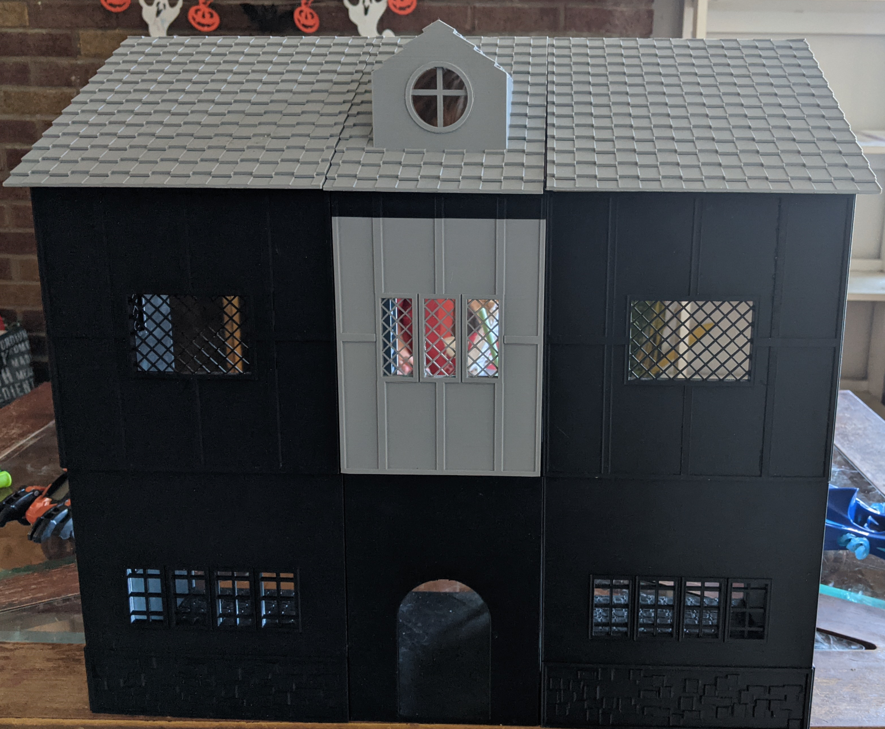<br />

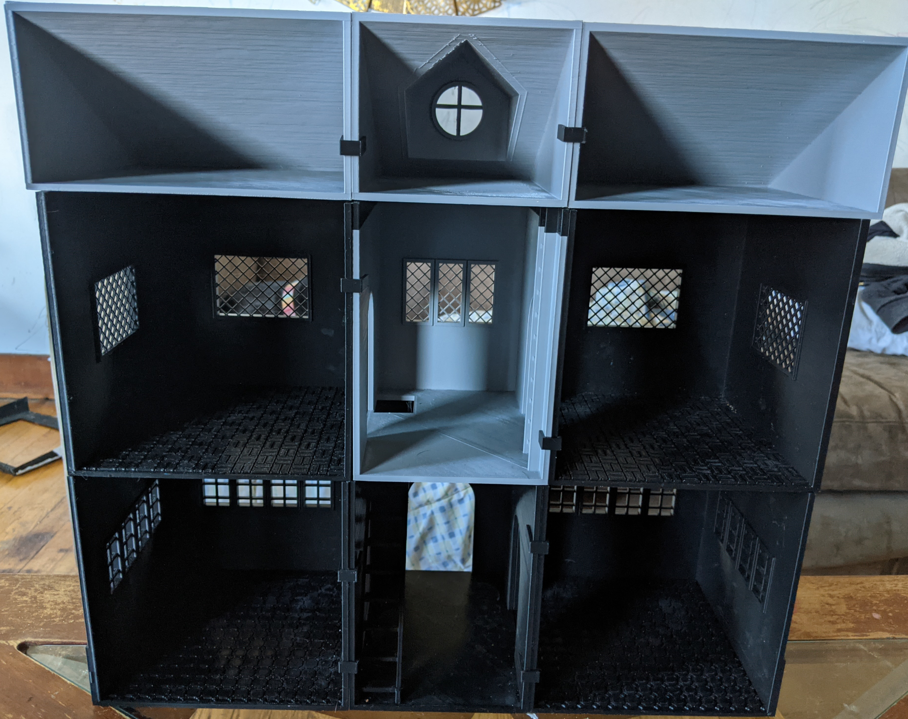<br />

## Description

First large project I've attempted using CadQuery. <br />
Goal was to make a modular dollhouse for my kids.

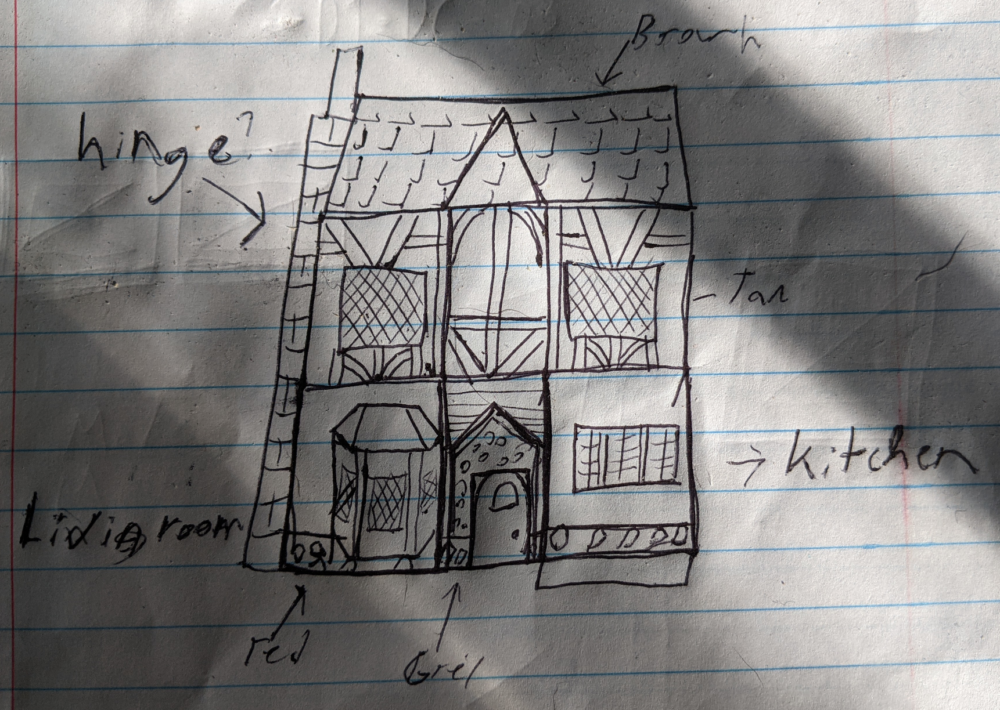<br />


It's a tudor style house with inspiration drawn from google image searches.<br />
The central idea is that it would be printed in roughly nine sections. With the floors and roof divided into three sections each.

I opted for the main rooms to be 175mm x 175mm x 175mm or roughly 7" x 7" x 7".<br />
Which is about the limits of my print bed.

---
## Code Overview

### Dependencies
* [CadQuery](https://cadquery.readthedocs.io/en/latest/) - Python Cad Libary
* [CQ-Editor](https://github.com/CadQuery/CQ-editor) - GUI to see model changes
* [cadqueryhelper](https://github.com/medicationforall/cadqueryhelper) - Shape primitives libraries, used for object repetition. (I wrote this)
* [cqterrain](https://github.com/medicationforall/cqterrain) - Primary library used to build the house (I authored this as well)

I opted for python code to make the cad model because I like making 3d models with code.<br />I've used [OpenSCAD](https://openscad.org/) in the past, but it has limitations for large projects.

### Pros
* Python has a large ecosystem
* Parts of the model can be broken up into smaller modules and tested in solation.
* Version control - I can review changes to the model before committing.
* [Github](https://github.com/) - code is kept in the cloud in a private (or public) repo.
* Re-using code from one project to the next is pretty straight forward.

### Cons
* Tedious, the project itself was 500+ lines of code just for the dollhouse itself.
* The re-usable api was expanded out as the model was being created, which slowed down development.
* If there are bugs in your logic tracking them down can be arduous, the generated models do not lend themselves well to unit tests.

---

### In The Beginning
The initial outline of the project.
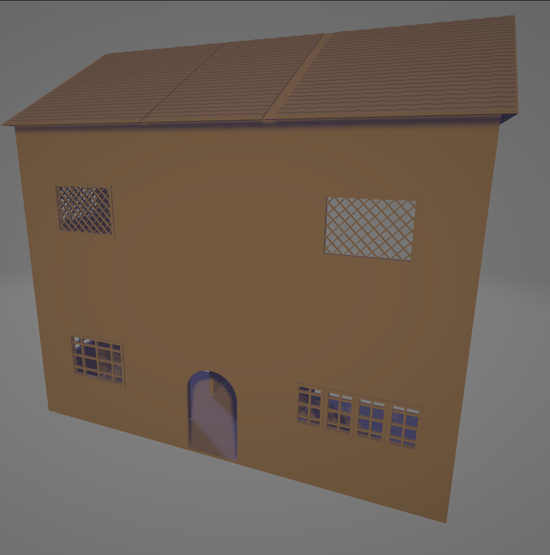<br />
The front is too boring

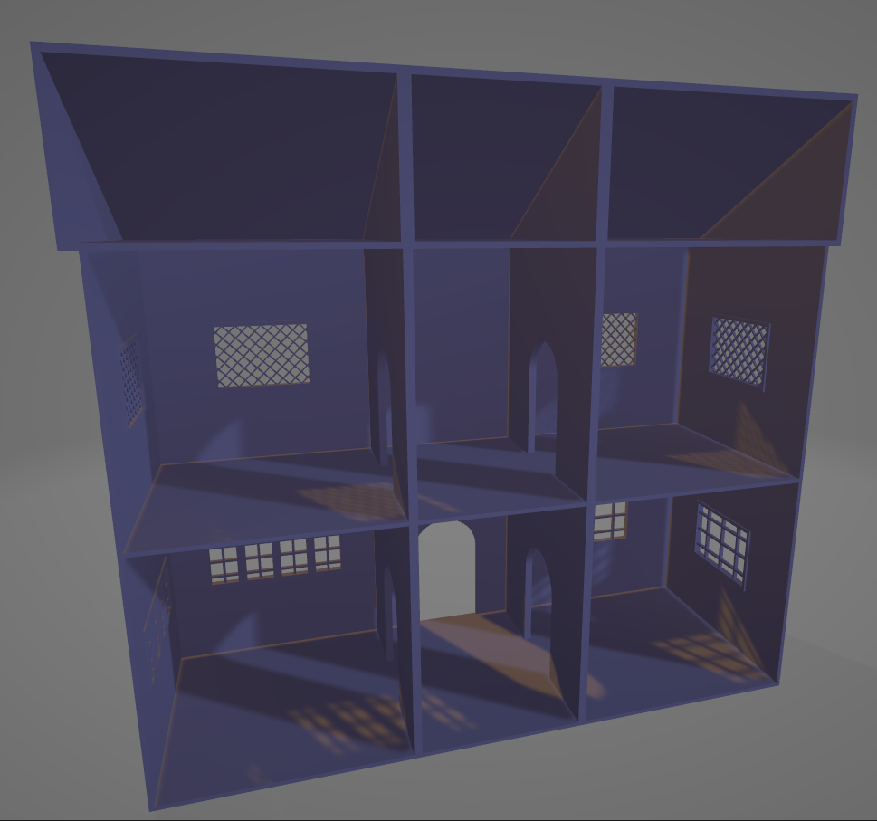<br />
Shows the breakdown of the nine sections.

---

### Adding Exterior Details
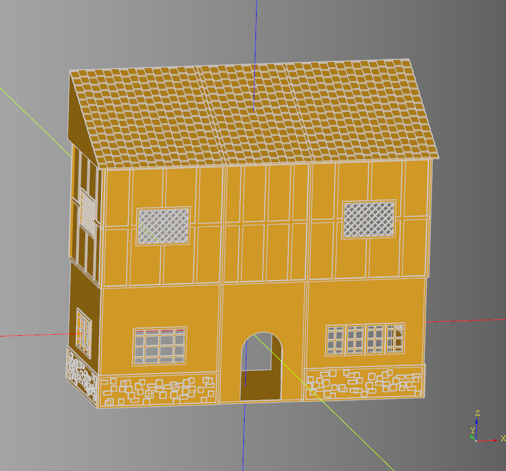<br />
I ended up simplifying from the initial sketch.

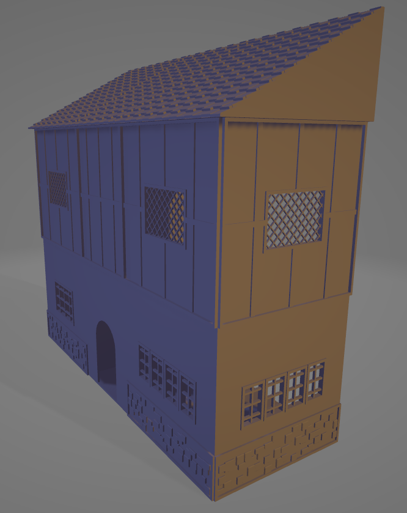<br />
I used [Microsoft 3d Viewer](https://all3dp.com/2/microsoft-3d-viewer-guide/) to generate the lighting on the model

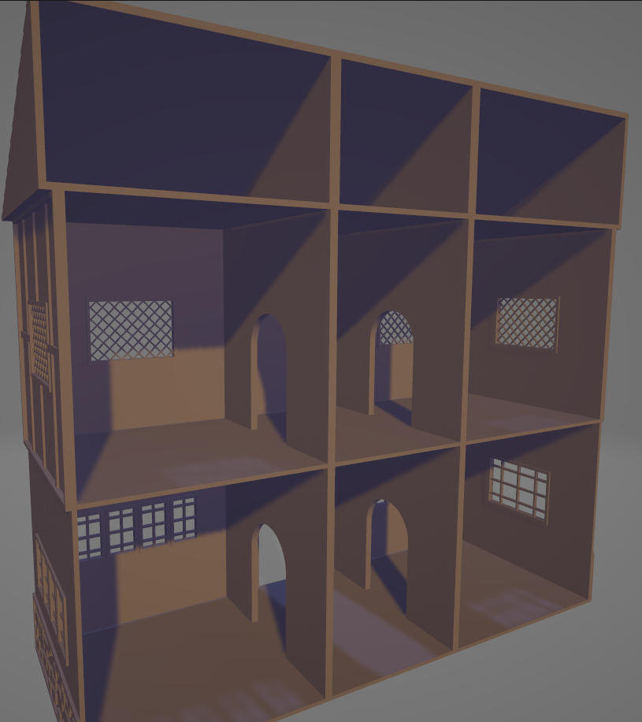<br />
Interior is still plain

* Arches
* Stones
* Casement Windows
* Lattice Windows
* Roof

---

## Arches
The arch cutouts are straight forward.<br />
``` python
def make_arch_door(wall, length, width, height, floor_height):
    # find the bottom of the wall to align to.
    bottom = wall.faces("-Z").val()

    #create the initial shape
    cutout = (cq.Workplane(bottom.Center())
              .box(length, width, height)
              .translate((0,0,(height/2)+floor_height))
              )

    # round off the top          
    cutout = cutout.faces("Z").edges("Y").fillet((length/2)-.5)

    #remove the arch from the wall
    w = wall.cut(cutout)
    return w
```
The arch is aligned to the bottom of the object it's being cut out of.
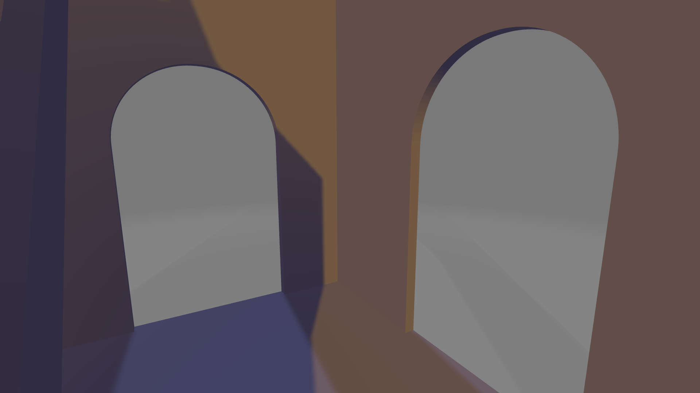<br />


### Stones
I opted, to write a pseudo-random stone pattern generator
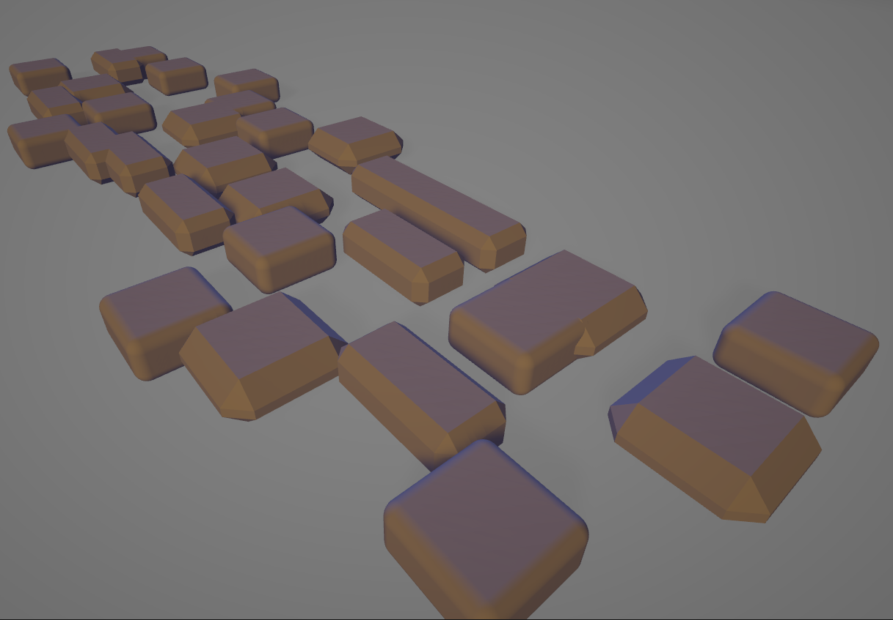<br />

Code for a stone section.

``` python
def add_stones(wall, length, height, wall_width, rotate=0, seed="test4"):
    # static boxes to act as stone
    tile = cq.Workplane("XY").box(10,10,2)
    tile2 = cq.Workplane("XY").box(8,8,2)
    tile3 = cq.Workplane("XY").box(6,12,2)

    # create an array of the stones and chamfer / fillet to add interest to the shapes.
    stone_list = [tile.chamfer(0.8), tile2.fillet(.5), tile3.chamfer(0.5)]

    # This is the pattern generator
    stones = stone.make_stones(stone_list, [12,12,2], columns = 14, rows = 3, seed=seed).rotate((0,1,0),(0,0,0), 90).rotate((0,0,1),(0,0,0), 90)

    # Align the pattern and surround with a frame
    stones = stones.translate((0,-2,-1*(height/2)+(24))).rotate((0,0,1),(0,0,0), rotate)
    frame = window.frame(length, 2, 48).translate((0,-1*((1)+(wall_width/2)),-1*(height/2)+(24))).rotate((0,0,1),(0,0,0), rotate)

    # Add the detailing to the room wall
    return wall.add(stones).add(frame)
```

* The generated output of the stone pattern is defined by the seed.
  * different seed means different stone placement.

Let's looks at cqterrain [stone.make_stones](https://github.com/medicationforall/cqterrain/blob/main/src/cqterrain/stone.py) code.

``` python
import cadquery as cq
import random
import math

def make_stones(parts, dim=[5,5,2], rows=2, columns=5, seed="test4"):
    grid = cq.Assembly()
    random.seed(seed)

    # loop the rows
    for row_i in range(rows):
        row_offset = (dim[0] * row_i)
        # loop the columns per row
        for col_i in range(columns):
            col_offset = (dim[1] * col_i)

            col_push_x = 0
            col_push_y = 0
            if col_i % 2 == 1:
                col_push_x = 0
                col_push_y = 0

            z_push=0
            # move the part in a random direction along the x and y axis.
            x_rand = random.randrange(-1*(math.floor(dim[0]/2)),(math.floor(dim[0]/2)))
            y_rand = random.randrange(-1*(math.floor(dim[1]/2)),(math.floor(dim[1]/2)))

            # choose a random part from the parts list
            part_index = random.randrange(0,len(parts))

            # add the part to the assembly
            grid.add(parts[part_index], loc=cq.Location(cq.Vector(row_offset + col_push_x + x_rand, col_offset + col_push_y + y_rand, z_push)))

    length = dim[1] * columns
    width = dim[0] * rows

    # dump the assembly out as a single compound
    comp = grid.toCompound()
    work = cq.Workplane("XZ").center(0, 0).workplane()
    work.add(comp)

    # zero out the grid
    work = work.translate(((dim[0]/2),(dim[1]/2)))
    work = work.translate((-1*(width/2),-1*(length/2)))
    return work
```

* That's all of of it, the double for loop isn't ideal but I kept it for readability.
* I basically yoinked my code for laying a tile onto a grid, and modified it to support pseudo-random selection and placement.
* It's not perfect but it's good enough to give the impression of a stone pattern.
* The code isn't resource intensive since it's made up of very simple primitives.

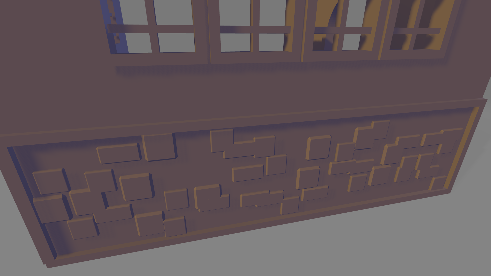<br />

## Casement Windows
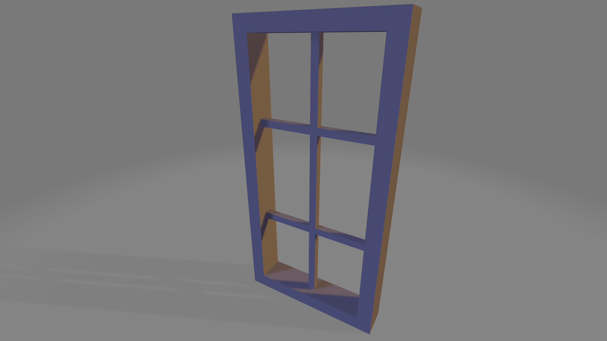<br />

Code for making the windows.
``` python
def casement_windows(wall, length, width, height, count, padding):
    # Create the cut out the holes where the windows will be placed.
    window_cutout = cq.Workplane().box(length, width, height)
    window_cut_series = series(window_cutout, count, length_offset = padding)

    # create the window frame, and grill.
    i_window = window.frame(length, width+3, height)
    grill = window.grill(length=length, width=4, height=height, rows=4, columns=2, grill_width=2, grill_height=3)
    i_window.add(grill)

    # Create the window set
    window_series = series(i_window, count, length_offset = padding)

    # Remove the cutout and add the windows
    w = wall.cut(window_cut_series)
    w = w.add(window_series)

    return w
```

Making the grill.

``` python
def grill(length=20, width=4, height=40, columns=4, rows=2, grill_width=1, grill_height=1):
    # Make a flat plane
    pane = cq.Workplane("XY").box(length, grill_height, height)
    t_width = length / columns
    t_height = height / rows

    # Make the window cutout
    tile = cq.Workplane("XY").box(t_width, grill_height, t_height).rotate((1,0,0),(0,0,0),90)

    # Repeat the cutout
    tiles = grid.make_grid(tile, [t_width+grill_width, t_height+grill_width], rows=columns, columns=rows).rotate((1,0,0),(0,0,0),-90)

    # Remove the window cutouts leaving the frame
    combine = pane.cut(tiles)
    return combine
```

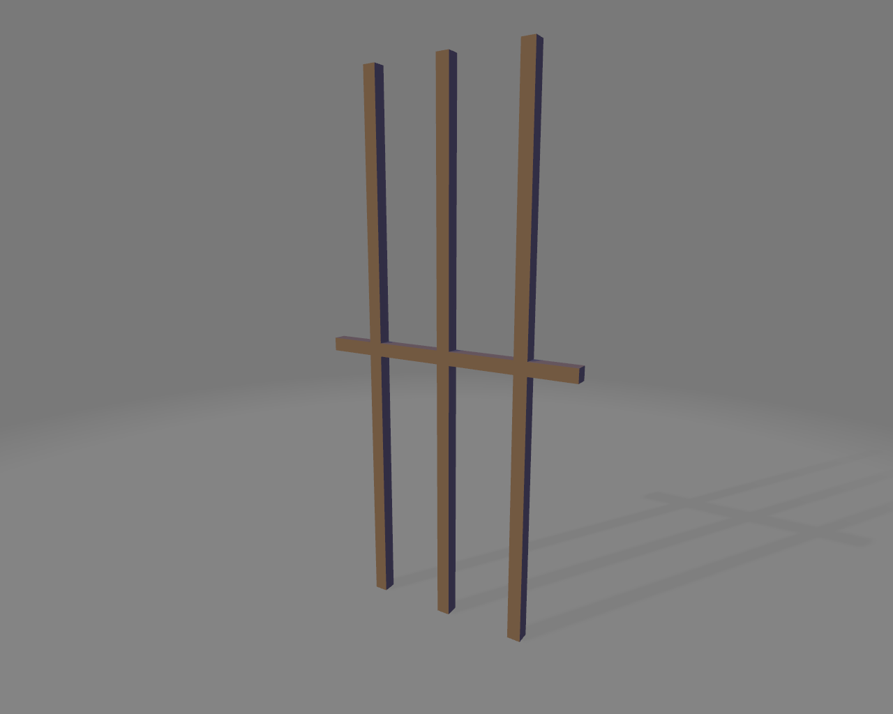<br />
The tudor framing on the outside of the house are just these casement window grills.

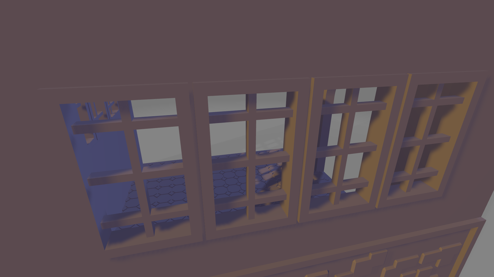<br />


### Lattice Windows
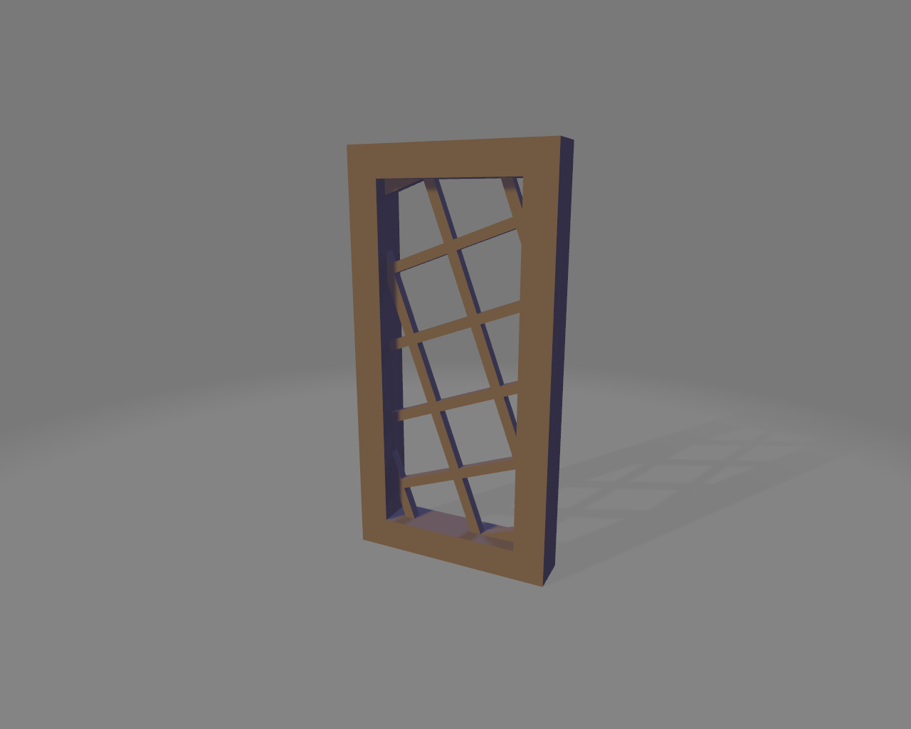<br />

The only difference between the casement and the lattice is the grill pattern.

``` python
def lattice(length=20, width=4, height=40,  tile_size=4, lattice_width=1, lattice_height=1, lattice_angle=45):
    # Determine longest distance between points
    hyp = math.hypot(length, height)
    columns= math.floor(hyp / (tile_size+lattice_width))
    rows= math.floor(hyp / (tile_size+lattice_width))

    # Make a flat plane
    pane = cq.Workplane("XY").box(length, lattice_height, height)

    #make the cutout tile
    tile = cq.Workplane("XY").box(tile_size, lattice_height, tile_size).rotate((1,0,0),(0,0,0),90)
    tiles = grid.make_grid(tile, [tile_size+lattice_width, tile_size+lattice_width], rows=columns, columns=rows).rotate((1,0,0),(0,0,0),-90).rotate((0,1,0),(0,0,0),lattice_angle)
    combine = pane.cut(tiles)
    return combine
```
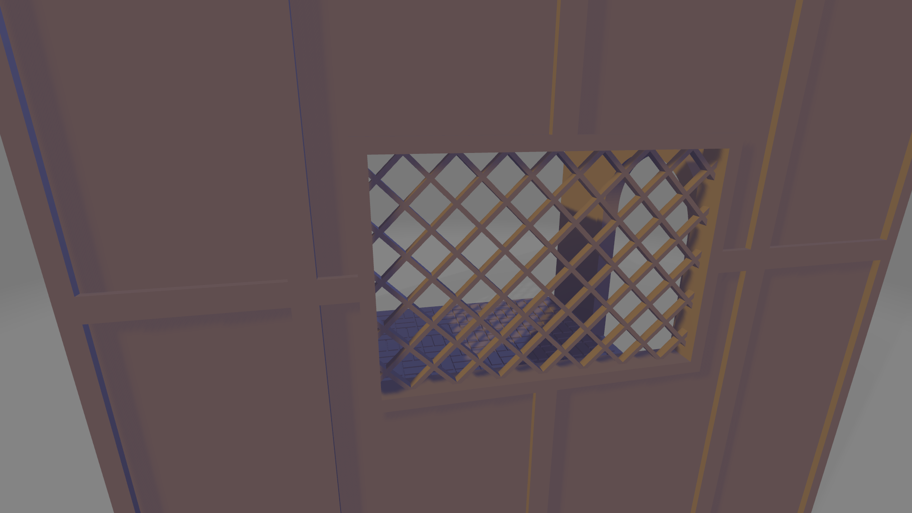<br />


### Roof
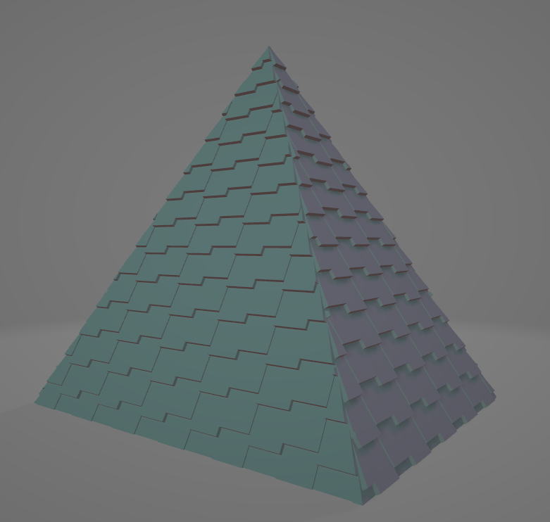<br />
The roof tiles were a struggle but it was a good opportunity re-learn some trigonometry.

Code to make a roof.
``` python
def make_roof(roof_width=185, x_offset=0):
    # Make the wedge shape
    gable_roof_raw = roof.dollhouse_gable(length=roof_width, width=185, height=100)

    # Shell the roof to cut out the inside
    gable_roof = roof.shell(gable_roof_raw,face="Y", width=-4)

    # Determine the arccosine angle of the roof
    angle = roof.angle(185, 100)
    face_x = gable_roof_raw.faces("<X")

    # Feature to enable/disable rendering roof tiles
    if render_roof_tiles:
        # Individual roof tile
        tile = cq.Workplane("XY").box(15,12,2).rotate((0,1,0),(0,0,0),8)
        # Grid of tiles
        tiles = roof.tiles(tile, face_x, 185, 100, 15, 12, angle, rows=28, odd_col_push=[3,0], intersect=False).rotate((0,0,1),(0,0,0),90).translate((3,45,0))
        tiles = tiles.translate((x_offset,0,0))

        # Cut away box to remove excess tiles
        inter_tiles = cq.Workplane("XY").box(roof_width,185, 100)
        inter_tiles = tiles.intersect(inter_tiles)
        return gable_roof.add(inter_tiles)
    else:
        # Quick roof no tiles
        return gable_roof
```
Making the tiles is resource intensive, so a feature flag was added for quick rendering.

Making the wedge
``` python
def dollhouse_gable(length= 40, width=40, height=40):
    roof = cq.Workplane("XY" ).wedge(length,height,width,0,0,length,0).rotate((1,0,0), (0,0,0), -90)
    return roof
```

Shell the roof
``` python
def shell(part, face="-Z", width=-1):
    result = part.faces(face).shell(width)
    return result
```

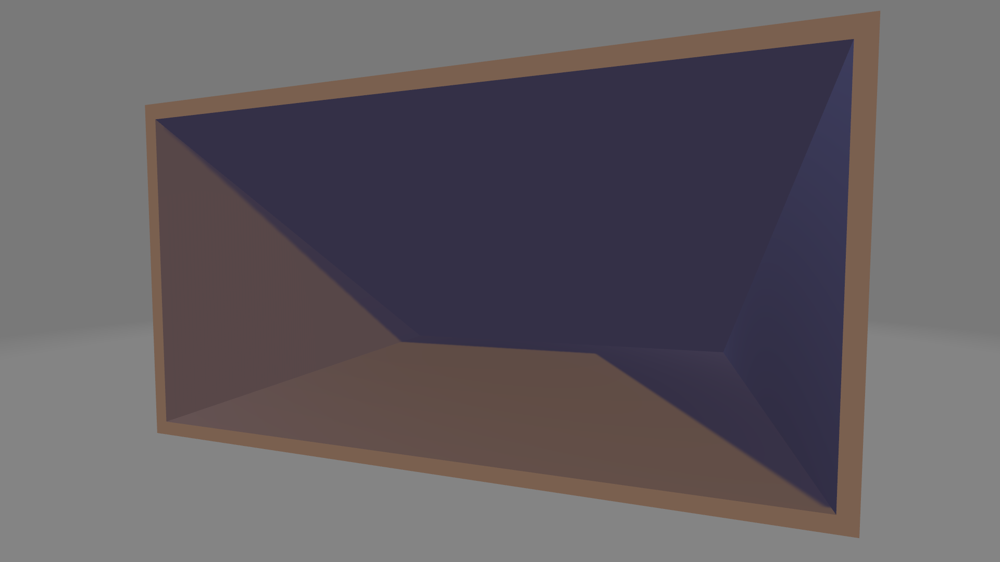<br />

Determine angle
``` python
def angle(length, height):
    '''
    Presumed length and height are part of a right triangle
    '''
    hyp = math.hypot(length, height)
    angle = length/hyp
    angle_radians = math.acos((angle))
    angle_deg = math.degrees(angle_radians)
    return angle_deg
```

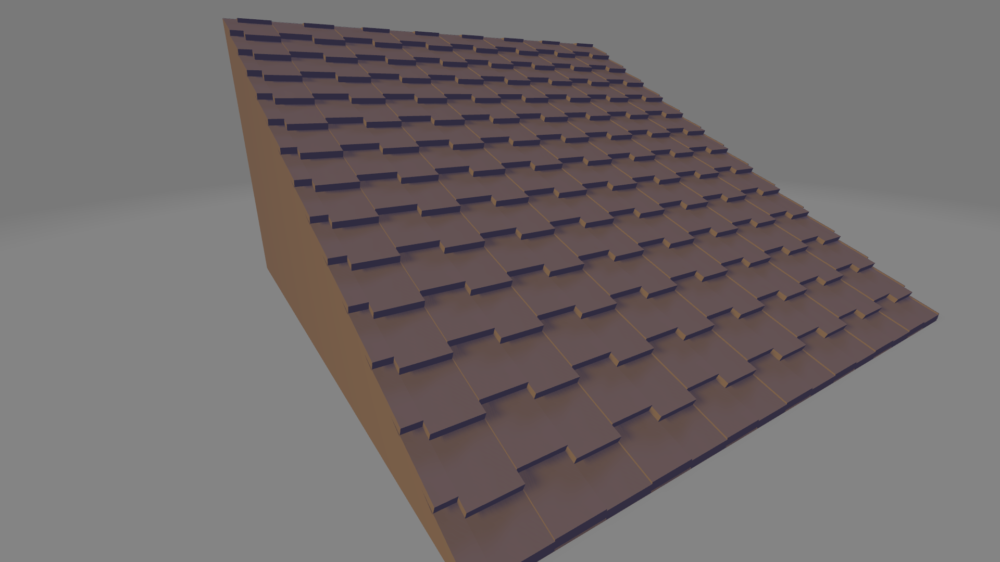<br />

---

## Additional Features
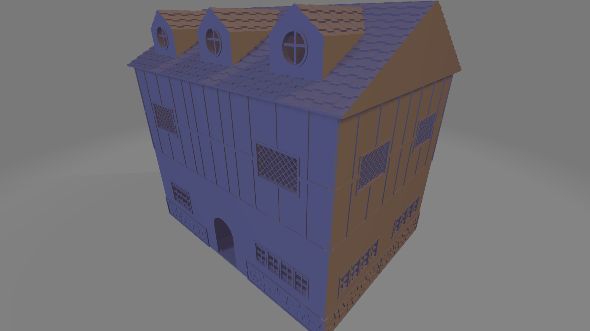<br />

* Roof Dormers
* Ladder
* Stairs
* Floor Tiles


### Roof Dormer
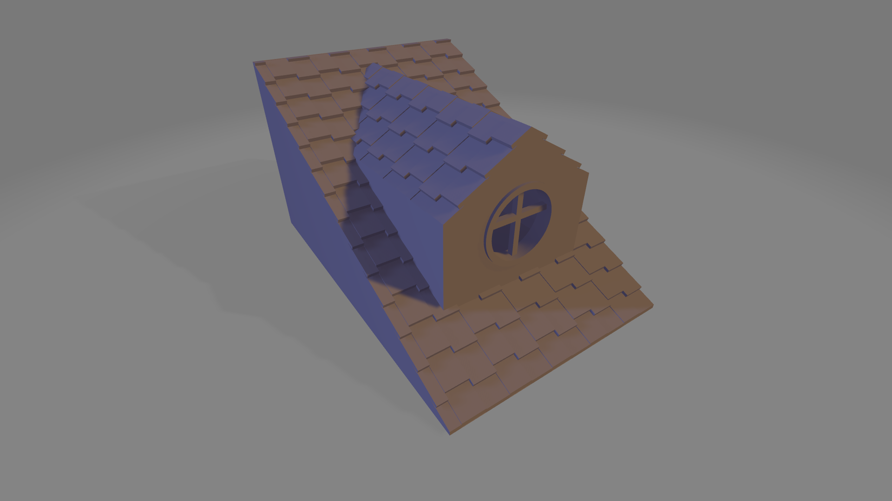<br />

Implementation of the dormer

``` python
def make_dormer_roof(roof_part, width=185):
    # Wedge Used for cutout
    gable_roof_raw = roof.dollhouse_gable(length=width, width=185, height=100).translate((0,0,-4.5))

    length=185
    height = 100
    inner_height = 60

    # Sub roof of the dormer
    roof_half_one = roof.dollhouse_gable(length=140, width=40, height=30).translate((0,0,29)).rotate((0,0,1),(0,0,0),90).translate((-20,15,0))
    roof_half_two = roof.dollhouse_gable(length=140, width=40, height=30).translate((0,0,29)).rotate((0,0,1),(0,0,0),-90).translate((20,15,0))

    # Render the tiles of the dormer
    if render_roof_tiles:
        angle = roof.angle(40, 30)
        face_x = roof_half_one.faces(">X")
        tile = cq.Workplane("XY").box(15,12,2).rotate((0,1,0),(0,0,0),8)
        tiles = roof.tiles(tile, face_x, 140, 30, 15, 12, angle, rows=4, odd_col_push=[3,0], intersect=False).translate((-14.5,23,29))
        tiles2 = roof.tiles(tile, face_x, 140, 30, 15, 12, angle, rows=4, odd_col_push=[3,0], intersect=False).translate((-14.5,23,29)).rotate((0,0,1),(0,0,0),180).translate((0,46,0))

    # make the body / walls of the cut-away dormer aligned to the parent roof. combine the body of the dormer with the dormer roof
    # this one is solid
    inner = roof_part.faces("<Z").box(80,110,inner_height, combine=False).translate((0,0,inner_height/2+4))
    inner = inner.union(roof_half_one).union(roof_half_two)

    # make the body / walls of the actual dormer aligned to the parent roof. combine the body of the dormer with the dormer roof
    # this one is shelled
    inner_shell = roof_part.faces("<Z").box(80,140,inner_height, combine=False).translate((0,15,inner_height/2+4))
    inner_shell = inner_shell.union(roof_half_one).union(roof_half_two)
    inner_shell = inner_shell.faces(">Y").shell(-4)

    # cut away excess tiles
    if render_roof_tiles:
        tile_cut = cq.Workplane("XY").box(40,140,50).translate((20,15,25))
        tile_cut2 = cq.Workplane("XY").box(40,140,50).translate((-20,15,25))

        tiles = tiles.intersect(tile_cut)
        tiles2 = tiles2.intersect(tile_cut2)

        inner_shell = inner_shell.add(tiles).add(tiles2)

    # shell the dormer roof
    inner_shell = inner_shell.cut(gable_roof_raw)

    # Place the dormer onto the roof part
    combine = roof_part.cut(inner).add(inner_shell)

    # Add the window to the dormer
    window_slug = inner.faces("<Y").cylinder(8,20,combine=False).rotateAboutCenter((1,0,0),90).translate((0,2.5,10))
    window_inner = inner.faces("<Y").cylinder(8,17,combine=False).rotateAboutCenter((1,0,0),90).translate((0,2.5,10))
    win_frame = window_slug.cut(window_inner)
    grill = window.grill(40, 5, 40, 2, 2, 3, 3 ).translate((0,-52,5))
    combine = combine.cut(window_slug).add(win_frame).add(grill)

    return combine
```

Overall the dormer was complicated to make, and the code needs to be refactored and broken up.

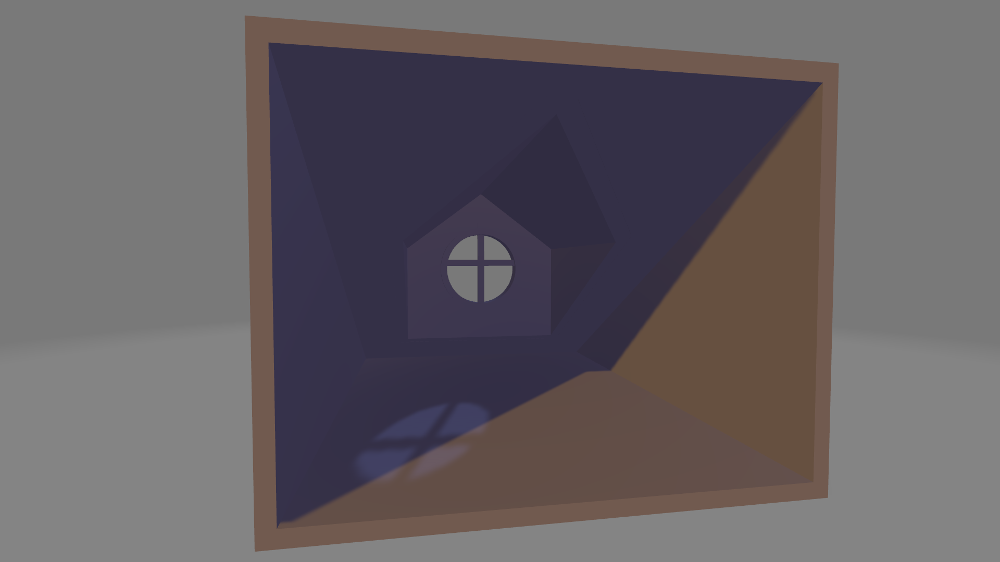<br />

### Ladder
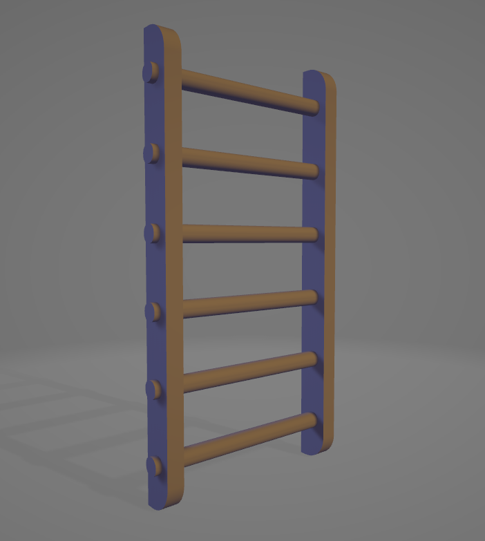<br />

``` python
# Create a latter instance
ladder_bp = Ladder(length=30, height=175, width=8)
# Set sub-part parameters
ladder_bp.rung_padding = 12
ladder_bp.rung_height = 3
ladder_bp.rung_width = 3

# make the sub parts
ladder_bp.make()

# Combine the parts into one solid.
ladder = ladder_bp.build().rotate((0,0,1),(0,0,0),90).translate((55,-60,175))
```
cqterrain class - [Ladder code](https://github.com/medicationforall/cqterrain/blob/main/src/cqterrain/Ladder.py).<br />
Ladders are a totally different pattern. <br />they are class objects with two lifecycles:
* *make* creates the sub-parts.
* *build* assembles the parts into a solid.

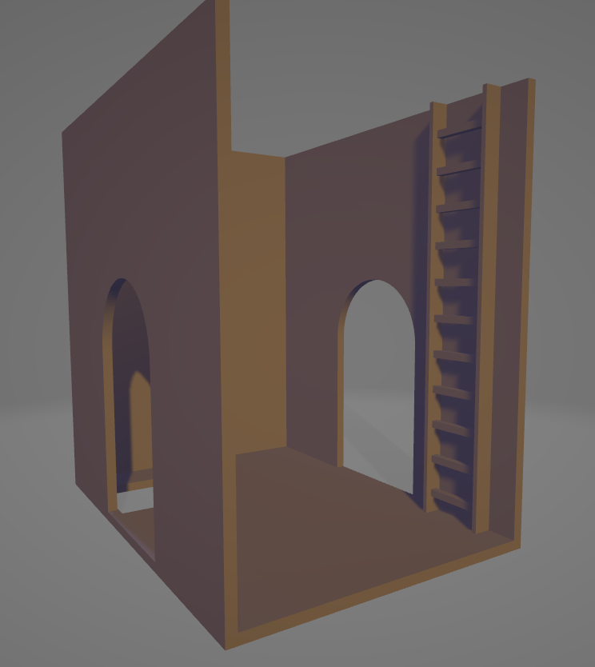<br />

### Stairs
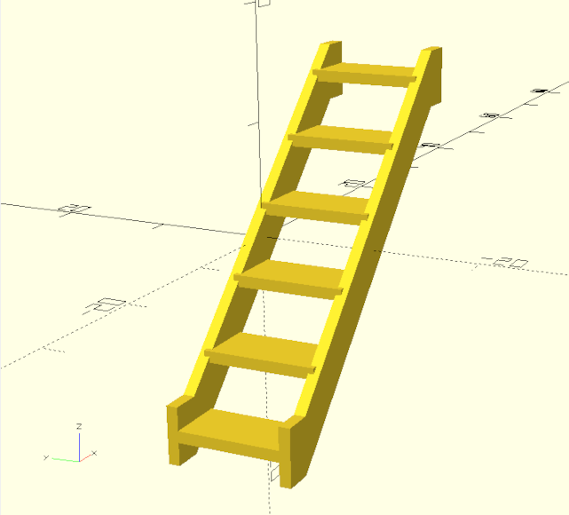<br />

``` python
stair_lower = stairs(
length = 148,
width = 32,
height = 175,
run = 8,
stair_length_offset = 5.35,
stair_height = 3,
stair_height_offset = -.8,
rail_width = 3,
rail_height = 14,
step_overlap = None
)
```
* [Documentation](https://github.com/medicationforall/cqterrain/blob/main/documentation/stairs.md)
* [Code](https://github.com/medicationforall/cqterrain/blob/main/src/cqterrain/stairs.py)

Stairs are an older pattern in cqterrain, you call the constructor with parameters and it returns the solid.<br />
The code is planned to be replaced.

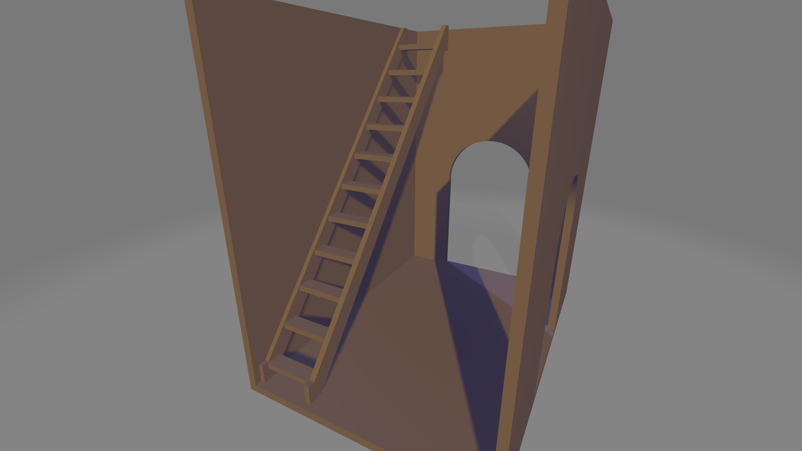<br />

### Floor Tiles

The project used two variants of Floor tiles.

#### Octagon With Dots

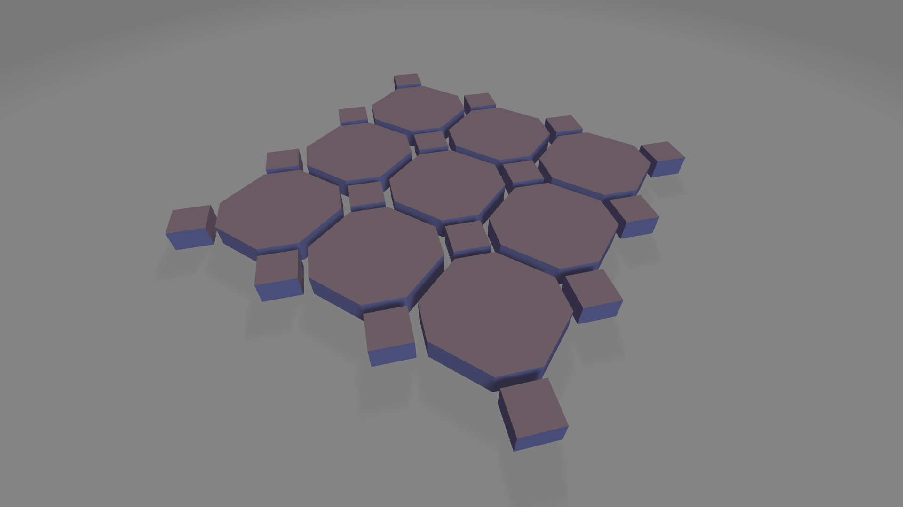<br />


Tile code
``` python
def octagon_with_dots(tile_size=5, chamfer_size = 1.2, mid_tile_size =1.6, spacing = .5 ):
    tile = (cq.Workplane("XY")
            .rect(tile_size,tile_size)
            .extrude(1)
            .edges("|Z")
            .chamfer(chamfer_size) # SET PERCENTAGE
            )

    rotated_tile = tile.rotate((0,0,1),(0,0,0), 45)

    mid_tile = (cq.Workplane("XY")
            .rect(mid_tile_size, mid_tile_size)
            .extrude(1)
            .rotate((0,0,1),(0,0,0), 45)
            )

    tiles = grid.make_grid(tile, [tile_size + spacing,tile_size + spacing], rows=3, columns=3)
    center_tiles = grid.make_grid(mid_tile, [tile_size + spacing, tile_size + spacing], rows=4, columns=4)

    combined = tiles.add(center_tiles).translate((0,0,-1*(1/2)))
    return combined
```

Two sets of tiles overlaid ontop of each other.<br />
When a tile is applied to a room; the code is built to know what to do with that.

``` python
  bp.floors[0].floor_tile = tile.octagon_with_dots(10, 2.4, 3.2, 1)
  bp.floors[0].floor_tile_padding = 1
  bp.floors[0].make()
```

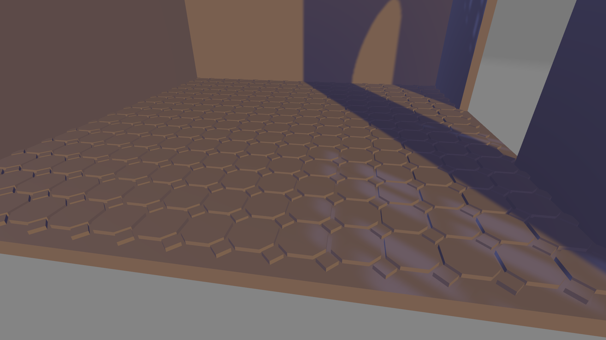<br />

#### Basketweave

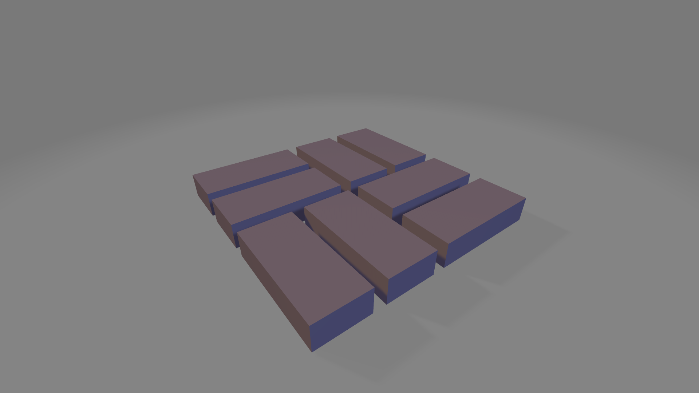<br />

``` python
def basketweave(length = 4, width = 2, height = 1, padding = .5):
    length_padding = length + padding
    width_padding = width + padding
    rect = (
            cq.Workplane("XY")
            .box(width, length_padding, height)
            .center(width_padding, 0)
            .box(width, length_padding, height)
            .translate((-1*(width_padding/2), 0, 0))
            )

    rect2 = (
            cq.Workplane("XY")
            .box(width, length_padding, height)
            .center(width_padding, 0)
            .box(width, length_padding, height)
            .translate((-1*(width_padding/2), 0, 0))
            .rotate((0,0,1), (0,0,0), 90)
            .translate((width_padding*2, 0, 0))
        )

    combine = (cq.Workplane("XY").union(rect).union(rect2).translate((-1*(width_padding),0,0)))
    combine2 = (cq.Workplane("XY")
                .union(combine)
                .rotate((0,0,1),(0,0,0), 180)
                .translate((0,width_padding*2,0))
                )

    tile_combine = cq.Workplane("XY").union(combine).union(combine2).translate((0,-1*(width_padding),0))
    return tile_combine
```

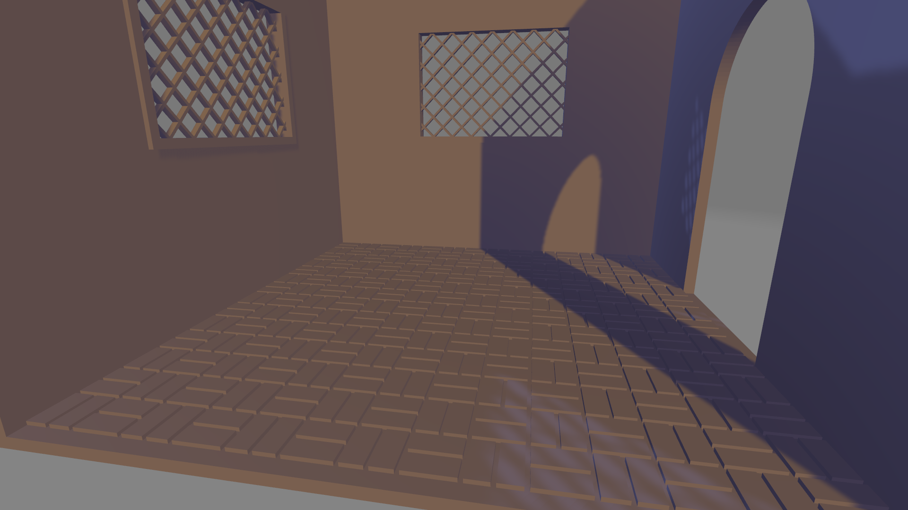<br />

---
## Printing

* On average each part takes about 2 days to print.
* I spent 3 weeks printings parts.
* No Support materials were needed for any of the parts.
* The part modularity was a plus, and allows the kids to re-organize the house into different shapes or multiple smaller houses.
* If I were to do this again I would add a more robust mechanism for connecting parts together.

<br />

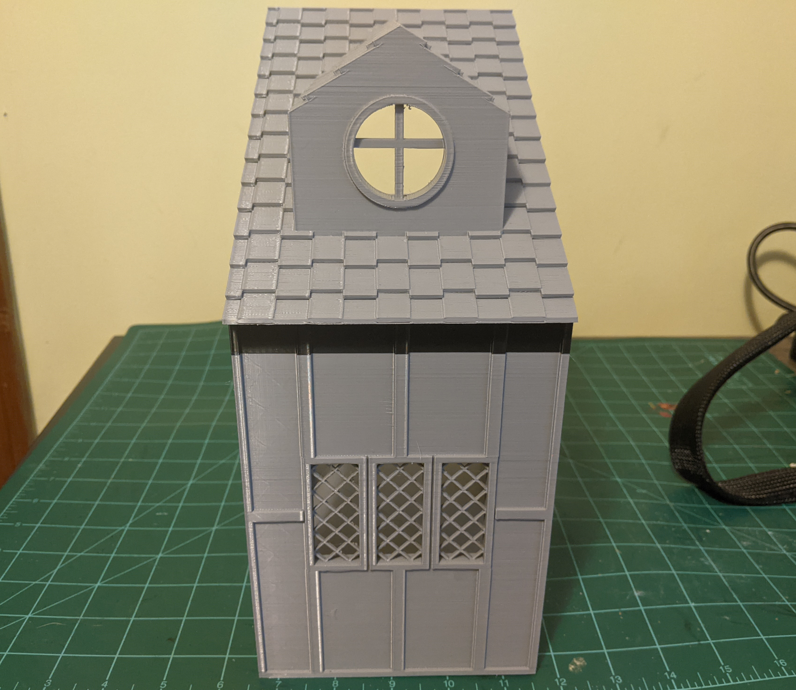<br />

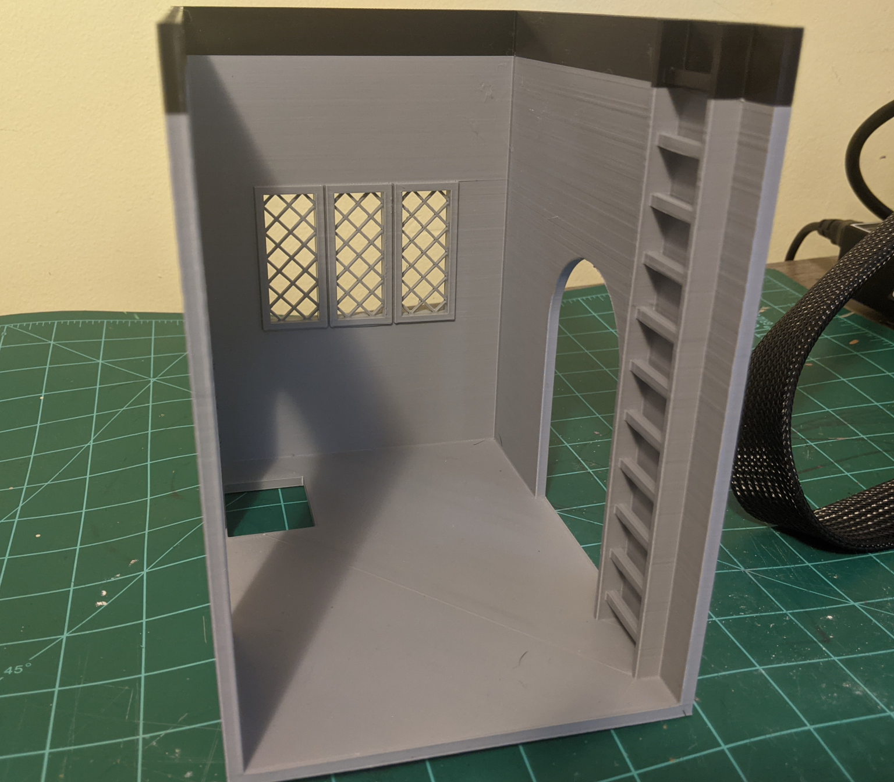<br />

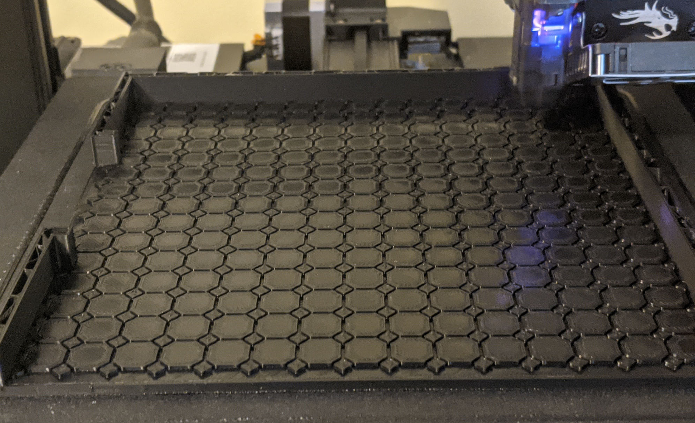<br />

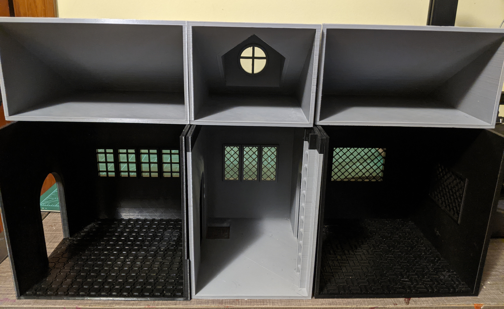<br />

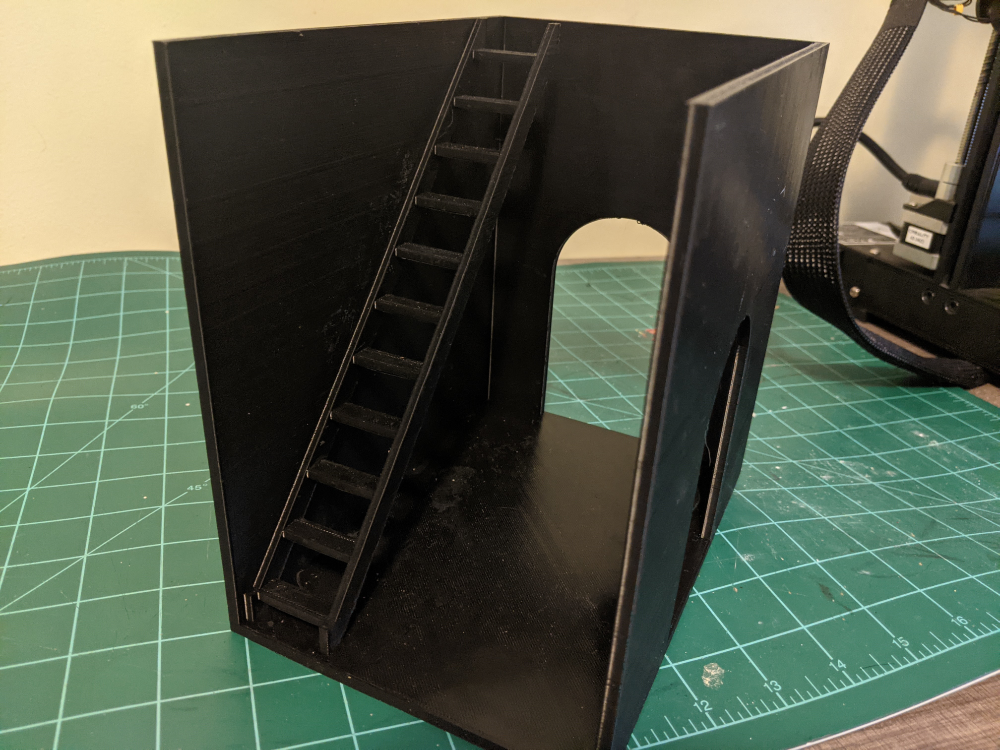<br />
